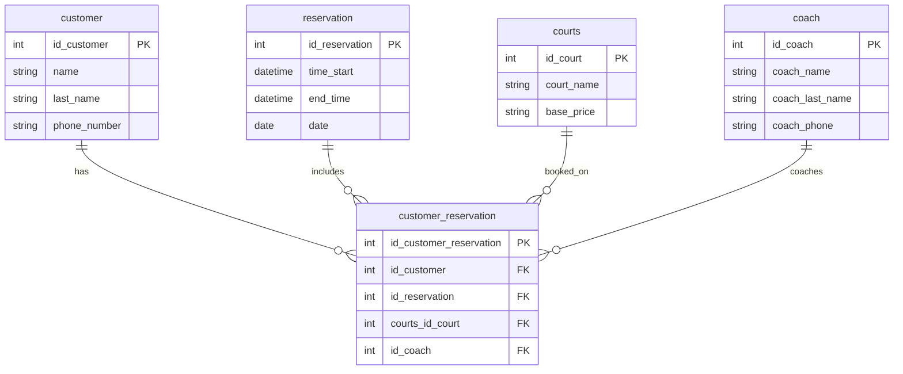
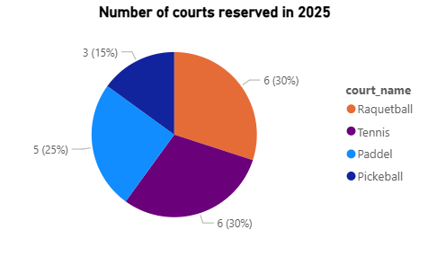
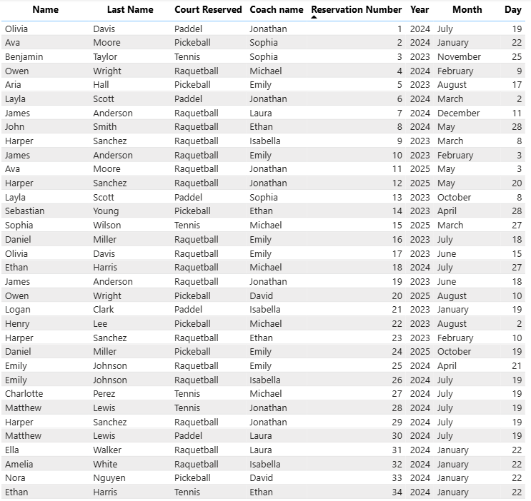

# Final project documentation

---

## Database summary report

### Project Overview

**Raquet Club** is a fiction company based in Fort Wayne that specializes in sports involving racquets, such as Tennis, pickeball, Paddel, and racquetball. The club offers multiple courts and coaching sessions, provides memberships for clients of all ages and experiences.

The primary users of this datbaase will be the company's analyst, financial team and service personnel. Analyst and finance staff will rely on the database to gather accurate information for budgeting, revenue tracking, and financial forecasting. Meanwhile, the service and scheduling teams will use it to organize court reservations, manage coaching sessions and oversee the day to day operations of the club.

### Users view
From a user's view, the database will make every small detail of the company easy to reach and see. The service personnel can quickly view customers's upcoming courts and times, history, profile and wether a customer is new or returning. They can also check the availability of coaches, and identify open time stlots for walk in sessions or last-minute appointments.

Additionaly, if we focus on other tasks that are not part of daily operations, the database allow the staff to create meaninful reports for managment. These reports may include quarterly, montly or yearly. Because the data is stores in real time, these reports remain accurate, up-to-date, and easy to regenerate whenever new insights are needed. This level of visibilirty helps the organization make informed decisions to improve porfitability, customer service, and overall efficiency.


## Database ER Model


### Database Design Description
The database is built around four normalized entities: `coach`, `courts`, `reservation`, and `customer`. Each table stores information related to the reservation of each customer. reservation stores the time, end time, and the date. courts stores the type of court for the sport and the base price. The coach table stores the different coaches available with their personal information such as first and last name and phone number. customer stores the personal information for each customer, and customer_reservation is the main table that stores all the information for a customer's reservation including the time and date, court reserved, name of customer, and whether they need a coach or not.

A big normalization part in this project was understanding if I could store the customer with its reservation in one table; however, if I would’ve done that, the table would have duplicated customer information.

`coach`
The coach table stores personal information about the coaches: name, last name, and phone number. This is the primary information for each of the eight coaches.

`courts`
The courts table stores the courts_name and base_price. In this case, we only have 4 courts available, one for each sport. The base price is the amount the customer pays before tax (in this example I did not include tax anywhere).

`reservation`
The reservation table stores the start time, end time, and the date the reservation is occurring. It stores this with the ID_reservation so it can be connected to the customer_reservation table.

`customer`
The customer table stores all the private information of the customer: first name, last name, and phone number. It allows the system to associate the reservation with a customer and, if needed, contact the right person about a reservation.

`customer_reservation`
This is the central table used to retrieve information about each customer reservation. This table stores four foreign keys from all other tables, allowing it to connect all the parts of the reservation.

---

### Create Tables 
The following SQL statements create the `coach`, `customer`, `reservation`, `courts` and `customer_reservation` tables in the current database.

```sql

-- -----------------------------------------------------
-- COURTS Table
-- Stored the different types fo courts available and
-- the base price of each court
-- -----------------------------------------------------
CREATE TABLE IF NOT EXISTS `courts` (
  `id_court` INT NOT NULL AUTO_INCREMENT,
  `court_name` VARCHAR(45) NOT NULL,
  `base_price` VARCHAR(45) NOT NULL,
  PRIMARY KEY (`id_court`),
  UNIQUE INDEX `id_court_UNIQUE` (`id_court` ASC) VISIBLE)
ENGINE = InnoDB
AUTO_INCREMENT = 0;

-- -----------------------------------------------------
-- CUSTOMER TABLE
-- Store the personal information of the customers
-- -----------------------------------------------------
CREATE TABLE IF NOT EXISTS `customer` (
  `id_customer` INT NOT NULL AUTO_INCREMENT,
  `name` VARCHAR(45) NOT NULL,
  `last_name` VARCHAR(45) NULL DEFAULT NULL,
  `phone_number` VARCHAR(45) NOT NULL,
  PRIMARY KEY (`id_customer`),
  UNIQUE INDEX `id_customer_UNIQUE` (`id_customer` ASC) VISIBLE)
ENGINE = InnoDB
AUTO_INCREMENT = 0;

-- -----------------------------------------------------
-- RESERVATION TABLE
-- Store the information of date and time of each reservation
-- -----------------------------------------------------
CREATE TABLE IF NOT EXISTS `reservation` (
  `id_reservation` INT NOT NULL AUTO_INCREMENT,
  `time_start` DATETIME(6) NOT NULL,
  `end_time` DATETIME(6) NOT NULL,
  `date` DATE NOT NULL,
  PRIMARY KEY (`id_reservation`),
  UNIQUE INDEX `id_reservation_UNIQUE` (`id_reservation` ASC) VISIBLE)
ENGINE = InnoDB;

-- -----------------------------------------------------
-- Table `coach`
-- -----------------------------------------------------
CREATE TABLE IF NOT EXISTS `coach` (
  `id_coach` INT NOT NULL AUTO_INCREMENT,
  `coach_name` VARCHAR(45) NOT NULL,
  `coach_last_name` VARCHAR(45) NOT NULL,
  `coach_phone` VARCHAR(45) NOT NULL,
  `active` TINYINT(1) NULL DEFAULT '1',
  PRIMARY KEY (`id_coach`),
  UNIQUE INDEX `id_coach_UNIQUE` (`id_coach` ASC) VISIBLE,
  UNIQUE INDEX `coach_name_UNIQUE` (`coach_name` ASC) VISIBLE,
  UNIQUE INDEX `coach_last_name_UNIQUE` (`coach_last_name` ASC) VISIBLE,
  UNIQUE INDEX `coach_phone_UNIQUE` (`coach_phone` ASC) VISIBLE)
ENGINE = InnoDB
AUTO_INCREMENT = 0;

-- -----------------------------------------------------
-- CUSTOMER RESERVATION TABLE
-- Store the custumer with it's specific reservation,
-- type of court and if using a coach or not
-- -----------------------------------------------------
CREATE TABLE IF NOT EXISTS `customer_reservation` (
  `id_customer_reservation` INT NOT NULL AUTO_INCREMENT,
  `id_customer` INT NOT NULL,
  `id_reservation` INT NOT NULL,
  `courts_id_court` INT NOT NULL,
  `id_coach` INT NULL,
  PRIMARY KEY (`id_customer_reservation`),
  INDEX `fk_customer_reservation_customer_idx` (`id_customer` ASC) INVISIBLE,
  INDEX `fk_customer_reservation_reservation1_idx` (`id_reservation` ASC) VISIBLE,
  INDEX `fk_customer_reservation_courts1_idx` (`courts_id_court` ASC) VISIBLE,
  INDEX `fk_customer_reservation_coach1_idx` (`id_coach` ASC) VISIBLE,
  UNIQUE INDEX `id_customer_reservation_UNIQUE` (`id_customer_reservation` ASC) VISIBLE,
  CONSTRAINT `fk_customer_reservation_courts1`
    FOREIGN KEY (`courts_id_court`)
    REFERENCES `courts` (`id_court`),
  CONSTRAINT `fk_customer_reservation_customer`
    FOREIGN KEY (`id_customer`)
    REFERENCES `customer` (`id_customer`),
  CONSTRAINT `fk_customer_reservation_reservation1`
    FOREIGN KEY (`id_reservation`)
    REFERENCES `reservation` (`id_reservation`),
  CONSTRAINT `fk_customer_reservation_coach1`
    FOREIGN KEY (`id_coach`)
    REFERENCES `coach` (`id_coach`)
    ON DELETE NO ACTION
    ON UPDATE NO ACTION)
ENGINE = InnoDB;
```

---

### Insert data
The following SQL insert sample data for the `court` (x4), `customer` (x60), and `reservation` (x165), `customer_reservation` (x179), `coach` (x8) tables in the current database.

```sql

/* --------------------------------------------------------
    - COURT SAMPLE DATA (X4)
   -------------------------------------------------------- */

INSERT INTO `courts` (`id_court`, `court_name`, `base_price`) VALUES ('1', 'Tennis', '50');
INSERT INTO `courts` (`id_court`, `court_name`, `base_price`) VALUES ('2', 'Pickeball', '35');
INSERT INTO `courts` (`id_court`, `court_name`, `base_price`) VALUES ('3', 'Raquetball', '30');
INSERT INTO `courts` (`id_court`, `court_name`, `base_price`) VALUES ('4', 'Paddel', '50');

/* --------------------------------------------------------
    - COACH SAMPLE DATA (X8)
   -------------------------------------------------------- */
INSERT INTO coach (coach_name, coach_last_name, coach_phone)
VALUES
('Michael', 'Thompson', '260-555-1823'),
('Laura', 'Gonzalez', '260-555-7741'),
('David', 'Ramirez', '260-555-3398'),
('Sophia', 'Martinez', '260-555-8842'),
('Ethan', 'Walker', '260-555-6670'),
('Isabella', 'Hughes', '260-555-9012'),
('Jonathan', 'Kim', '260-555-4429'),
('Emily', 'Stevens', '260-555-7305');

/* --------------------------------------------------------
    - CUSTOMER SAMPLE DATA (X60)
   -------------------------------------------------------- */
INSERT INTO customer (name, last_name, phone_number) VALUES
('John', 'Smith', '555-201-4432'),
('Emily', 'Johnson', '555-982-1144'),
('Michael', 'Brown', '555-771-9833'),
('Olivia', 'Davis', '555-663-1299'),
('Daniel', 'Miller', '555-448-2290'),
('Sophia', 'Wilson', '555-744-9934'),
('James', 'Anderson', '555-310-8841'),
('Emma', 'Thomas', '555-997-5402'),
('Benjamin', 'Taylor', '555-675-4122'),
( 'Ava', 'Moore', '555-223-9988'),
( 'Lucas', 'Jackson', '555-119-0345'),
( 'Mia', 'Martin', '555-882-3311'),
( 'Henry', 'Lee', '555-502-8804'),
( 'Charlotte', 'Perez', '555-664-7110'),
( 'Alexander', 'Thompson', '555-991-2043'),
( 'Amelia', 'White', '555-320-9114'),
( 'Ethan', 'Harris', '555-452-2333'),
( 'Harper', 'Sanchez', '555-888-1902'),
( 'Logan', 'Clark', '555-732-5227'),
( 'Luna', 'Ramirez', '555-408-6611'),
( 'Matthew', 'Lewis', '555-290-7483'),
( 'Ella', 'Walker', '555-640-9899'),
( 'Sebastian', 'Young', '555-770-5521'),
( 'Aria', 'Hall', '555-234-9981'),
( 'Jack', 'Allen', '555-811-4554'),
( 'Camila', 'King', '555-442-2294'),
( 'Owen', 'Wright', '555-554-7133'),
( 'Layla', 'Scott', '555-912-4200'),
( 'Leo', 'Torres', '555-345-9902'),
( 'Nora', 'Nguyen', '555-822-6491'),
('Daniel', 'Reynolds', '260-555-4102'),
('Mariana', 'Lopez', '260-555-9984'),
('Carlos', 'Guzman', '260-555-7315'),
('Victoria', 'Sanders', '260-555-2841'),
('Felipe', 'Ortiz', '260-555-6630'),
('Angelica', 'Ruiz', '260-555-1774'),
('Samuel', 'James', '260-555-9031'),
('Natalia', 'Castro', '260-555-4420'),
('Brandon', 'Phillips', '260-555-8667'),
('Lucia', 'Torres', '260-555-1928'),
('Gabriel', 'Montoya', '260-555-5703'),
('Jasmine', 'Sullivan', '260-555-6179'),
('Ricardo', 'Valdez', '260-555-8840'),
('Camila', 'Rojas', '260-555-3049'),
('Andres', 'Mora', '260-555-1273'),
('Katherine', 'Brooks', '260-555-0231'),
('Sergio', 'Paredes', '260-555-9021'),
('Emily', 'Navarro', '260-555-5691'),
('Diego', 'Salazar', '260-555-6674'),
('Michelle', 'Harrison', '260-555-8417'),
('Ivan', 'Cortez', '260-555-7449'),
('Paula', 'Hernandez', '260-555-3157'),
('Anthony', 'Reeves', '260-555-0294'),
('Laura', 'Vega', '260-555-5551'),
('Oscar', 'Marquez', '260-555-2083'),
('Daniela', 'Ramirez', '260-555-9801'),
('Hector', 'Campos', '260-555-4127'),
('Jennifer', 'Payne', '260-555-2934'),
('Mauricio', 'Zamora', '260-555-7540'),
('Sofia', 'Delgado', '260-555-6198');

/* --------------------------------------------------------
    - RESERVATION SAMPLE DATA (X142)
   -------------------------------------------------------- */
INSERT INTO reservation (time_start, end_time, date) VALUES
('2024-07-19 04:38:25.000000', '2024-07-19 07:03:16.000000', '2024-07-19'),
('2024-01-22 09:36:40.000000', '2024-01-22 11:49:17.000000', '2024-01-22'),
('2023-11-25 10:11:23.000000', '2023-11-25 11:44:37.000000', '2023-11-25'),
('2024-02-09 18:15:47.000000', '2024-02-09 19:23:53.000000', '2024-02-09'),
('2023-08-17 18:58:43.000000', '2023-08-17 21:07:54.000000', '2023-08-17'),
('2024-03-02 11:20:46.000000', '2024-03-02 13:54:19.000000', '2024-03-02'),
('2024-12-11 17:33:01.000000', '2024-12-11 20:14:33.000000', '2024-12-11'),
('2024-05-28 16:25:15.000000', '2024-05-28 18:28:25.000000', '2024-05-28'),
('2023-03-08 10:45:26.000000', '2023-03-08 12:40:46.000000', '2023-03-08'),
('2023-02-03 08:35:58.000000', '2023-02-03 10:12:14.000000', '2023-02-03'),
('2025-05-03 11:50:34.000000', '2025-05-03 13:10:01.000000', '2025-05-03'),
('2025-05-20 09:43:52.000000', '2025-05-20 11:53:32.000000', '2025-05-20'),
('2023-10-08 16:34:50.000000', '2023-10-08 19:30:20.000000', '2023-10-08'),
('2023-04-28 12:51:36.000000', '2023-04-28 14:16:11.000000', '2023-04-28'),
('2025-03-27 12:14:47.000000', '2025-03-27 13:43:14.000000', '2025-03-27'),
('2023-07-18 18:33:45.000000', '2023-07-18 19:40:34.000000', '2023-07-18'),
('2023-06-15 08:18:01.000000', '2023-06-15 09:15:51.000000', '2023-06-15'),
('2024-07-27 16:23:10.000000', '2024-07-27 18:15:37.000000', '2024-07-27'),
('2023-06-18 12:43:37.000000', '2023-06-18 14:45:16.000000', '2023-06-18'),
('2025-08-10 10:39:47.000000', '2025-08-10 12:38:06.000000', '2025-08-10'),
('2023-01-19 14:24:44.000000', '2023-01-19 17:06:38.000000', '2023-01-19'),
('2023-08-02 15:02:50.000000', '2023-08-02 17:04:24.000000', '2023-08-02'),
('2023-02-10 11:22:52.000000', '2023-02-10 12:33:35.000000', '2023-02-10'),
('2025-10-19 13:37:13.000000', '2025-10-19 15:57:13.000000', '2025-10-19'),
('2024-04-21 08:57:05.000000', '2024-04-21 11:25:36.000000', '2024-04-21'),
('2024-07-19 08:00:00.000000', '2024-07-19 09:15:00.000000', '2024-07-19'),
('2024-07-19 09:30:00.000000', '2024-07-19 10:45:00.000000', '2024-07-19'),
('2024-07-19 11:00:00.000000', '2024-07-19 12:15:00.000000', '2024-07-19'),
('2024-07-19 12:30:00.000000', '2024-07-19 13:45:00.000000', '2024-07-19'),
('2024-07-19 14:00:00.000000', '2024-07-19 15:15:00.000000', '2024-07-19'),
('2024-01-22 09:00:00.000000', '2024-01-22 10:30:00.000000', '2024-01-22'),
('2024-01-22 10:45:00.000000', '2024-01-22 12:00:00.000000', '2024-01-22'),
('2024-01-22 12:15:00.000000', '2024-01-22 13:30:00.000000', '2024-01-22'),
('2024-01-22 13:45:00.000000', '2024-01-22 15:00:00.000000', '2024-01-22'),
('2024-01-22 15:15:00.000000', '2024-01-22 16:30:00.000000', '2024-01-22'),
('2023-11-25 08:15:00.000000', '2023-11-25 09:30:00.000000', '2023-11-25'),
('2023-11-25 09:45:00.000000', '2023-11-25 11:00:00.000000', '2023-11-25'),
('2023-11-25 11:15:00.000000', '2023-11-25 12:30:00.000000', '2023-11-25'),
('2023-11-25 12:45:00.000000', '2023-11-25 14:00:00.000000', '2023-11-25'),
('2023-11-25 14:15:00.000000', '2023-11-25 15:30:00.000000', '2023-11-25'),
('2024-02-09 08:30:00.000000', '2024-02-09 09:45:00.000000', '2024-02-09'),
('2024-02-09 10:00:00.000000', '2024-02-09 11:30:00.000000', '2024-02-09'),
('2024-02-09 11:45:00.000000', '2024-02-09 13:00:00.000000', '2024-02-09'),
('2024-02-09 13:15:00.000000', '2024-02-09 14:30:00.000000', '2024-02-09'),
('2024-02-09 14:45:00.000000', '2024-02-09 16:00:00.000000', '2024-02-09'),
('2023-08-17 08:00:00.000000', '2023-08-17 09:30:00.000000', '2023-08-17'),
('2023-08-17 09:45:00.000000', '2023-08-17 11:00:00.000000', '2023-08-17'),
('2023-08-17 11:15:00.000000', '2023-08-17 12:45:00.000000', '2023-08-17'),
('2023-08-17 13:00:00.000000', '2023-08-17 14:15:00.000000', '2023-08-17'),
('2023-08-17 14:30:00.000000', '2023-08-17 15:45:00.000000', '2023-08-17'),
('2023-03-08 10:00:00.000000', '2023-03-08 11:15:00.000000', '2023-03-08'),
('2023-03-08 11:30:00.000000', '2023-03-08 12:45:00.000000', '2023-03-08'),
('2023-03-08 13:00:00.000000', '2023-03-08 14:30:00.000000', '2023-03-08'),
('2023-03-08 14:45:00.000000', '2023-03-08 16:00:00.000000', '2023-03-08'),
('2023-03-08 16:15:00.000000', '2023-03-08 17:30:00.000000', '2023-03-08'),
('2025-05-03 08:30:00.000000', '2025-05-03 09:45:00.000000', '2025-05-03'),
('2025-05-03 10:00:00.000000', '2025-05-03 11:30:00.000000', '2025-05-03'),
('2025-05-03 11:45:00.000000', '2025-05-03 13:00:00.000000', '2025-05-03'),
('2025-05-03 13:15:00.000000', '2025-05-03 14:30:00.000000', '2025-05-03'),
('2025-05-03 14:45:00.000000', '2025-05-03 16:00:00.000000', '2025-05-03'),
('2025-05-20 09:00:00.000000', '2025-05-20 10:30:00.000000', '2025-05-20'),
('2025-05-20 10:45:00.000000', '2025-05-20 12:00:00.000000', '2025-05-20'),
('2025-05-20 12:15:00.000000', '2025-05-20 13:30:00.000000', '2025-05-20'),
('2025-05-20 13:45:00.000000', '2025-05-20 15:00:00.000000', '2025-05-20'),
('2025-05-20 15:15:00.000000', '2025-05-20 16:30:00.000000', '2025-05-20'),
('2023-10-08 08:15:00.000000', '2023-10-08 09:30:00.000000', '2023-10-08'),
('2023-10-08 09:45:00.000000', '2023-10-08 11:00:00.000000', '2023-10-08'),
('2023-10-08 11:15:00.000000', '2023-10-08 12:30:00.000000', '2023-10-08'),
('2023-10-08 12:45:00.000000', '2023-10-08 14:00:00.000000', '2023-10-08'),
('2023-10-08 14:15:00.000000', '2023-10-08 15:30:00.000000', '2023-10-08'),
('2023-04-28 08:30:00.000000', '2023-04-28 09:45:00.000000', '2023-04-28'),
('2023-04-28 10:00:00.000000', '2023-04-28 11:30:00.000000', '2023-04-28'),
('2023-04-28 11:45:00.000000', '2023-04-28 13:00:00.000000', '2023-04-28'),
('2023-04-28 13:15:00.000000', '2023-04-28 14:30:00.000000', '2023-04-28'),
('2023-04-28 14:45:00.000000', '2023-04-28 16:00:00.000000', '2023-04-28'),
('2024-09-01 15:07:18.000000', '2024-09-01 17:41:44.000000', '2024-09-01'),
('2025-03-21 09:30:49.000000', '2025-03-21 11:40:38.000000', '2025-03-21'),
('2023-06-09 08:46:14.000000', '2023-06-09 10:00:08.000000', '2023-06-09'),
('2024-02-17 13:34:21.000000', '2024-02-17 16:12:02.000000', '2024-02-17'),
('2025-07-09 18:18:31.000000', '2025-07-09 20:54:10.000000', '2025-07-09'),
('2023-12-03 09:39:42.000000', '2023-12-03 11:32:25.000000', '2023-12-03'),
('2024-08-19 11:44:14.000000', '2024-08-19 13:52:58.000000', '2024-08-19'),
('2025-11-10 16:49:37.000000', '2025-11-10 19:01:27.000000', '2025-11-10'),
('2023-02-27 14:25:03.000000', '2023-02-27 16:57:10.000000', '2023-02-27'),
('2024-05-19 08:41:55.000000', '2024-05-19 10:09:08.000000', '2024-05-19'),
('2025-09-16 15:54:29.000000', '2025-09-16 18:14:20.000000', '2025-09-16'),
('2023-08-11 13:57:07.000000', '2023-08-11 15:41:01.000000', '2023-08-11'),
('2024-01-14 16:21:39.000000', '2024-01-14 18:33:21.000000', '2024-01-14'),
('2025-04-30 11:09:12.000000', '2025-04-30 13:43:38.000000', '2025-04-30'),
('2023-03-04 10:32:31.000000', '2023-03-04 12:26:13.000000', '2023-03-04'),
('2024-07-13 09:18:46.000000', '2024-07-13 11:53:17.000000', '2024-07-13'),
('2025-08-03 17:24:18.000000', '2025-08-03 19:49:55.000000', '2025-08-03'),
('2023-11-29 15:05:04.000000', '2023-11-29 17:19:38.000000', '2023-11-29'),
('2024-03-08 12:43:51.000000', '2024-03-08 14:10:06.000000', '2024-03-08'),
('2025-10-23 10:28:40.000000', '2025-10-23 12:24:26.000000', '2025-10-23'),
('2023-04-02 08:58:29.000000', '2023-04-02 10:26:16.000000', '2023-04-02'),
('2024-06-28 13:34:18.000000', '2024-06-28 16:02:20.000000', '2024-06-28'),
('2025-01-03 16:01:45.000000', '2025-01-03 18:20:54.000000', '2025-01-03'),
('2023-07-30 11:58:36.000000', '2023-07-30 13:27:30.000000', '2023-07-30'),
('2024-10-21 18:09:27.000000', '2024-10-21 20:43:19.000000', '2024-10-21'),
('2023-05-02 09:21:14.000000', '2023-05-02 11:57:31.000000', '2023-05-02'),
('2024-09-10 10:47:52.000000', '2024-09-10 12:02:33.000000', '2024-09-10'),
('2025-03-15 14:44:03.000000', '2025-03-15 17:18:37.000000', '2025-03-15'),
('2023-10-24 13:27:45.000000', '2023-10-24 15:01:57.000000', '2023-10-24'),
('2024-11-05 11:15:12.000000', '2024-11-05 13:43:33.000000', '2024-11-05'),
('2025-07-26 08:33:59.000000', '2025-07-26 10:09:43.000000', '2025-07-26'),
('2023-01-23 15:41:18.000000', '2023-01-23 17:54:27.000000', '2023-01-23'),
('2024-02-03 16:02:06.000000', '2024-02-03 17:15:35.000000', '2024-02-03'),
('2025-09-01 12:19:41.000000', '2025-09-01 14:32:55.000000', '2025-09-01'),
('2023-09-02 10:17:38.000000', '2023-09-02 12:28:19.000000', '2023-09-02'),
('2024-05-24 09:49:07.000000', '2024-05-24 11:10:52.000000', '2024-05-24'),
('2025-11-14 14:37:16.000000', '2025-11-14 17:05:48.000000', '2025-11-14'),
('2023-06-26 18:20:25.000000', '2023-06-26 19:54:35.000000', '2023-06-26'),
('2024-01-18 08:26:52.000000', '2024-01-18 10:51:00.000000', '2024-01-18'),
('2025-04-18 17:51:40.000000', '2025-04-18 20:13:29.000000', '2025-04-18'),
('2023-03-21 14:10:31.000000', '2023-03-21 15:23:47.000000', '2023-03-21'),
('2024-07-01 13:43:58.000000', '2024-07-01 16:01:45.000000', '2024-07-01'),
('2025-08-21 11:54:44.000000', '2025-08-21 13:17:39.000000', '2025-08-21'),
('2023-11-16 09:06:13.000000', '2023-11-16 11:44:01.000000', '2023-11-16'),
('2024-03-14 15:50:39.000000', '2024-03-14 17:21:28.000000', '2024-03-14'),
('2025-10-29 16:17:22.000000', '2025-10-29 18:49:01.000000', '2025-10-29'),
('2023-04-25 11:11:37.000000', '2023-04-25 13:31:16.000000', '2023-04-25'),
('2024-06-13 10:24:06.000000', '2024-06-13 12:03:27.000000', '2024-06-13'),
('2025-01-11 09:33:49.000000', '2025-01-11 12:09:41.000000', '2025-01-11'),
('2023-07-11 16:27:30.000000', '2023-07-11 18:45:53.000000', '2023-07-11'),
('2024-10-02 17:14:58.000000', '2024-10-02 19:01:05.000000', '2024-10-02'),
('2023-05-20 08:49:26.000000', '2023-05-20 10:05:30.000000', '2023-05-20'),
('2024-09-06 12:51:34.000000', '2024-09-06 14:37:23.000000', '2024-09-06'),
('2025-03-06 18:00:41.000000', '2025-03-06 20:08:15.000000', '2025-03-06'),
('2023-10-13 13:03:08.000000', '2023-10-13 14:47:32.000000', '2023-10-13'),
('2024-11-09 15:29:54.000000', '2024-11-09 17:58:24.000000', '2024-11-09'),
('2025-07-30 10:41:37.000000', '2025-07-30 13:05:52.000000', '2025-07-30'),
('2023-02-05 09:26:43.000000', '2023-02-05 11:11:06.000000', '2023-02-05'),
('2024-04-03 11:40:18.000000', '2024-04-03 13:48:10.000000', '2024-04-03'),
('2025-09-10 16:32:44.000000', '2025-09-10 18:12:54.000000', '2025-09-10'),
('2023-08-06 14:37:25.000000', '2023-08-06 17:05:49.000000', '2023-08-06'),
('2024-01-10 10:59:52.000000', '2024-01-10 12:41:50.000000', '2024-01-10'),
('2025-04-25 08:44:37.000000', '2025-04-25 10:58:13.000000', '2025-04-25'),
('2023-03-01 16:22:11.000000', '2023-03-01 18:12:45.000000', '2023-03-01'),
('2024-07-10 12:13:40.000000', '2024-07-10 14:33:29.000000', '2024-07-10'),
('2025-08-13 09:59:33.000000', '2025-08-13 12:39:20.000000', '2025-08-13'),
('2023-11-21 18:24:31.000000', '2023-11-21 20:18:53.000000', '2023-11-21');

/* --------------------------------------------------------
    - CUSTOMER_RESERVATION SAMPLE DATA (X90)
   -------------------------------------------------------- */
INSERT INTO customer_reservation (id_customer, id_reservation, courts_id_court, id_coach) VALUES
(4, 1, 4, 7),
(10, 2, 2, 4),
(9, 3, 1, 4),
(27, 4, 3, 1),
(24, 5, 2, 8),
(28, 6, 4, 7),
(7, 7, 3, 2),
(1, 8, 3, 5),
(18, 9, 3, 6),
(7, 10, 3, 8),
(10, 11, 3, 7),
(18, 12, 3, 7),
(28, 13, 4, 4),
(23, 14, 2, 5),
(6, 15, 1, 1),
(5, 16, 3, 8),
(4, 17, 3, 8),
(17, 18, 3, 1),
(7, 19, 3, 7),
(27, 20, 2, 3),
(19, 21, 4, 6),
(13, 22, 2, 1),
(18, 23, 3, 5),
(5, 24, 2, 8),
(2, 25, 3, 8),
(2, 26, 3, 6),
(14, 27, 1, 1),
(21, 28, 1, 7),
(18, 29, 3, 7),
(21, 30, 4, 2),
(22, 31, 3, 2),
(16, 32, 3, 6),
(30, 33, 2, 3),
(17, 34, 1, 5),
(11, 35, 2, 2),
(22, 36, 4, 5),
(1, 37, 4, 6),
(23, 38, 1, 1),
(25, 39, 1, 3),
(1, 40, 2, 3),
(3, 41, 4, 7),
(18, 42, 1, 2),
(11, 43, 1, 7),
(28, 44, 3, 3),
(12, 45, 4, 7),
(18, 46, 1, 7),
(6, 47, 3, 5),
(23, 48, 3, 5),
(30, 49, 2, 8),
(28, 50, 2, 4),
(8, 51, 1, 8),
(26, 52, 1, 2),
(25, 53, 4, 7),
(22, 54, 1, 1),
(10, 55, 3, 5),
(21, 56, 1, 1),
(29, 57, 3, 1),
(4, 58, 4, 2),
(6, 59, 2, 8),
(2, 60, 3, 2),
(2, 61, 1, 5),
(5, 62, 3, 1),
(15, 63, 1, 2),
(24, 64, 4, 6),
(18, 65, 4, 7),
(6, 66, 3, 8),
(20, 67, 1, 8),
(10, 68, 3, 1),
(24, 69, 1, 4),
(24, 70, 2, 7),
(12, 71, 3, NULL),
(4, 72, 1, NULL),
(29, 73, 4, NULL),
(7, 74, 2, NULL),
(18, 75, 1, NULL),
(21, 76, 3, NULL),
(6, 77, 4, NULL),
(9, 78, 2, NULL),
(1, 79, 1, NULL),
(27, 80, 3, NULL),
(13, 81, 4, NULL),
(22, 82, 2, NULL),
(30, 83, 1, NULL),
(10, 84, 4, NULL),
(5, 85, 3, NULL),
(8, 86, 1, NULL),
(17, 87, 3, NULL),
(24, 88, 2, NULL),
(14, 89, 4, NULL),
(3, 90, 1, NULL);
```

---

### Queries

Queries using `coach`, `courts`, `customer`,  `customer_reservation`, `reservation` tables.

---

## Query 1 – `SELECT` with `ORDER BY` on two columns
This query shows the id_customer, courts_id_court, id_reservation, and id_coach ordered by id_customer and courts_id_court. This query is useful to see various things in a raw format: we are able to see if a customer is new or old, if they have reserved a specific court before, and we can see in the history of reservations whether they had a specific coach or if they had multiple coaches.

```sql
-- Query 1: Select customers's reservation including court and if they have a coach or not ordered by id_customer and court type

SELECT id_customer, courts_id_court, id_reservation, id_coach 
FROM customer_reservation
ORDER BY id_customer, courts_id_court
LIMIT 20;

```
***Sample Output**
```code
+-------------+-----------------+----------------+----------+
| id_customer | courts_id_court | id_reservation | id_coach |
+-------------+-----------------+----------------+----------+
|           1 |               1 |             79 |     NULL |
|           1 |               2 |             40 |        3 |
|           1 |               3 |              8 |        5 |
|           1 |               4 |             37 |        6 |
|           2 |               1 |             61 |        5 |
|           2 |               3 |             26 |        6 |
|           2 |               3 |             60 |        2 |
|           2 |               3 |             25 |        8 |
|           3 |               1 |             90 |     NULL |
|           3 |               4 |             41 |        7 |
|           4 |               1 |             72 |     NULL |
|           4 |               3 |             17 |        8 |
|           4 |               4 |              1 |        7 |
|           4 |               4 |             58 |        2 |
|           5 |               2 |             24 |        8 |
|           5 |               3 |             62 |        1 |
|           5 |               3 |             85 |     NULL |
|           5 |               3 |             16 |        8 |
|           6 |               1 |             15 |        1 |
|           6 |               2 |             59 |        8 |
+-------------+-----------------+----------------+----------+
20 rows in set (0.00 sec)
```

## Query 2 – `SELECT` with a calculated field (non-aggregate)
This query shows the amount of time the reservation was in place. It is used to see the average reservation time, and it is also useful to check whether a court is available at a certain time. Because the table uses datetime values, the time difference function is the correct formula to calculate how long the customer spent on the court.

```sql
-- Query 2: Show the start and end time of the reservation with a calculated column that show the duration of the reservation

SELECT *,
TIME_FORMAT(TIMEDIFF(end_time, time_start), '%H:%i') AS duration
FROM reservation
LIMIT 20;
```

**Sample Output**
```code
+----------------+----------------------------+----------------------------+------------+------+
| id_reservation | time_start                 | end_time                   | date       | time |
+----------------+----------------------------+----------------------------+------------+------+
|              1 | 2024-07-19 04:38:25.000000 | 2024-07-19 07:03:16.000000 | 2024-07-19 |    2 |
|              2 | 2024-01-22 09:36:40.000000 | 2024-01-22 11:49:17.000000 | 2024-01-22 |    2 |
|              3 | 2023-11-25 10:11:23.000000 | 2023-11-25 11:44:37.000000 | 2023-11-25 |    1 |
|              4 | 2024-02-09 18:15:47.000000 | 2024-02-09 19:23:53.000000 | 2024-02-09 |    1 |
|              5 | 2023-08-17 18:58:43.000000 | 2023-08-17 21:07:54.000000 | 2023-08-17 |    2 |
|              6 | 2024-03-02 11:20:46.000000 | 2024-03-02 13:54:19.000000 | 2024-03-02 |    2 |
|              7 | 2024-12-11 17:33:01.000000 | 2024-12-11 20:14:33.000000 | 2024-12-11 |    2 |
|              8 | 2024-05-28 16:25:15.000000 | 2024-05-28 18:28:25.000000 | 2024-05-28 |    2 |
|              9 | 2023-03-08 10:45:26.000000 | 2023-03-08 12:40:46.000000 | 2023-03-08 |    1 |
|             10 | 2023-02-03 08:35:58.000000 | 2023-02-03 10:12:14.000000 | 2023-02-03 |    1 |
|             11 | 2025-05-03 11:50:34.000000 | 2025-05-03 13:10:01.000000 | 2025-05-03 |    1 |
|             12 | 2025-05-20 09:43:52.000000 | 2025-05-20 11:53:32.000000 | 2025-05-20 |    2 |
|             13 | 2023-10-08 16:34:50.000000 | 2023-10-08 19:30:20.000000 | 2023-10-08 |    2 |
|             14 | 2023-04-28 12:51:36.000000 | 2023-04-28 14:16:11.000000 | 2023-04-28 |    1 |
|             15 | 2025-03-27 12:14:47.000000 | 2025-03-27 13:43:14.000000 | 2025-03-27 |    1 |
|             16 | 2023-07-18 18:33:45.000000 | 2023-07-18 19:40:34.000000 | 2023-07-18 |    1 |
|             17 | 2023-06-15 08:18:01.000000 | 2023-06-15 09:15:51.000000 | 2023-06-15 |    0 |
|             18 | 2024-07-27 16:23:10.000000 | 2024-07-27 18:15:37.000000 | 2024-07-27 |    1 |
|             19 | 2023-06-18 12:43:37.000000 | 2023-06-18 14:45:16.000000 | 2023-06-18 |    2 |
|             20 | 2025-08-10 10:39:47.000000 | 2025-08-10 12:38:06.000000 | 2025-08-10 |    1 |
+----------------+----------------------------+----------------------------+------------+------+
20 rows in set (0.00 sec)
Limit to 20 rows
```

## Query 3 – `SELECT` using a MariaDB function (non-aggregate)
This query shows the day, month, and year of a reservation by extracting each part from the date field. This is useful for filtering reservations by month, day, or year, and it also provides the information in a format that is easier to read than the full date.

```sql
-- Query 3: Extracts da, month and year from date
SELECT 
  id_reservation, 
  day(date) AS "Day", 
  month(date) AS "Month", 
  year(date) AS "Year" 
FROM reservation
LIMIT 20;
```

**Sample Output**
```code
+----------------+------+-------+------+
| id_reservation | Day  | Month | Year |
+----------------+------+-------+------+
|              1 |   19 |     7 | 2024 |
|              2 |   22 |     1 | 2024 |
|              3 |   25 |    11 | 2023 |
|              4 |    9 |     2 | 2024 |
|              5 |   17 |     8 | 2023 |
|              6 |    2 |     3 | 2024 |
|              7 |   11 |    12 | 2024 |
|              8 |   28 |     5 | 2024 |
|              9 |    8 |     3 | 2023 |
|             10 |    3 |     2 | 2023 |
|             11 |    3 |     5 | 2025 |
|             12 |   20 |     5 | 2025 |
|             13 |    8 |    10 | 2023 |
|             14 |   28 |     4 | 2023 |
|             15 |   27 |     3 | 2025 |
|             16 |   18 |     7 | 2023 |
|             17 |   15 |     6 | 2023 |
|             18 |   27 |     7 | 2024 |
|             19 |   18 |     6 | 2023 |
|             20 |   10 |     8 | 2025 |
+----------------+------+-------+------+
20 rows in set (0.00 sec)
```

---

## Query 4 – Aggregation with `GROUP BY` and `HAVING`
This query displays the total number of reservations made for each client in the customer_reservation table. It uses the count function to calculate the number of reservations a client has and groups them by id_client, filtering only for customers who have more than two reservations.

```sql
-- Query 4: Count reservations per customer and show only those with more than 2 reservations
SELECT id_customer, COUNT(id_reservation) AS total_reservations
FROM customer_reservation
GROUP BY id_customer
HAVING COUNT(id_reservation) > 2;
```

**Sample Output (example)**
```code
+-------------+--------------------+
| id_customer | total_reservations |
+-------------+--------------------+
|           4 |                  4 |
|          10 |                  5 |
|          27 |                  3 |
|          24 |                  5 |
|          28 |                  4 |
|           7 |                  4 |
|           1 |                  4 |
|          18 |                  8 |
|          23 |                  3 |
|           6 |                  5 |
|           5 |                  4 |
|          17 |                  3 |
|           2 |                  4 |
|          21 |                  4 |
|          22 |                  4 |
|          30 |                  3 |
+-------------+--------------------+
16 rows in set (0.00 sec)
```

---

## Query 5 – Join of three tables (`member`, `donation`, `project`)
This query joins the reservation, customer, courts, and coach tables to show each reservation along with the customer’s name, the court reserved, the court’s base price, and the assigned coach. One important detail is that this type of join only returns reservations that have a coach assigned, ignoring any reservations where the coach is NULL.

This query is useful for analyzing which customers had a coach during their reservation and tracking their reservation numbers. It helps identify coaching patterns, see which courts and coaches are most utilized, and understand customer preferences when a coach is involved.

```sql
-- Query 5: Join reservation, customer, coach, court to show reservations without coach
SELECT 
  a.id_reservation, 
  CONCAT(b.name, " ", b.last_name) AS "Customer", 
  c.court_name, 
  c.base_price, 
  CONCAT(d.coach_name, " ", d.coach_last_name) AS "Coach" 
  FROM customer_reservation AS a 
JOIN customer AS b ON a.id_customer = b.id_customer
JOIN courts AS c ON a.courts_id_court = c.id_court
JOIN coach AS d ON a.id_coach = d.id_coach
LIMIT 20;
```

**Sample Output (first x20)**
```code
+----------------+--------------------+------------+------------+------------------+
| id_reservation | Customer           | court_name | base_price | Coach            |
+----------------+--------------------+------------+------------+------------------+
|              3 | Benjamin Taylor    | Tennis     | 50         | Sophia Martinez  |
|             15 | Sophia Wilson      | Tennis     | 50         | Michael Thompson |
|             27 | Charlotte Perez    | Tennis     | 50         | Michael Thompson |
|             28 | Matthew Lewis      | Tennis     | 50         | Jonathan Kim     |
|             34 | Ethan Harris       | Tennis     | 50         | Ethan Walker     |
|             38 | Sebastian Young    | Tennis     | 50         | Michael Thompson |
|             39 | Jack Allen         | Tennis     | 50         | David Ramirez    |
|             42 | Harper Sanchez     | Tennis     | 50         | Laura Gonzalez   |
|             43 | Lucas Jackson      | Tennis     | 50         | Jonathan Kim     |
|             46 | Harper Sanchez     | Tennis     | 50         | Jonathan Kim     |
|             51 | Emma Thomas        | Tennis     | 50         | Emily Stevens    |
|             52 | Camila King        | Tennis     | 50         | Laura Gonzalez   |
|             54 | Ella Walker        | Tennis     | 50         | Michael Thompson |
|             56 | Matthew Lewis      | Tennis     | 50         | Michael Thompson |
|             61 | Emily Johnson      | Tennis     | 50         | Ethan Walker     |
|             63 | Alexander Thompson | Tennis     | 50         | Laura Gonzalez   |
|             67 | Luna Ramirez       | Tennis     | 50         | Emily Stevens    |
|             69 | Aria Hall          | Tennis     | 50         | Sophia Martinez  |
|              2 | Ava Moore          | Pickeball  | 35         | Sophia Martinez  |
|              5 | Aria Hall          | Pickeball  | 35         | Emily Stevens    |
+----------------+--------------------+------------+------------+------------------+
20 rows in set (0.00 sec)
```

---

## Query 6 – `LEFT JOIN` 
This query joins the reservation, customer, courts, and coach tables to show each reservation along with the customer’s name, the court reserved, the court’s base price, and the assigned coach. One important detail is that this type of join returns reservations that have a coach assigned and any reservations where the coach is NULL.

This query is useful to track all the reservations without excluding any, even if the coach is null, this can help track reservation for the company, see wich customers have a reservation with ot without coach, help with insights analyzing coach utilization versus reservation without coach.

```sql
-- Query 6: LEFT JOIN reservation, customer, coach, court to show sll reservations 
SELECT 
  a.id_reservation, 
  CONCAT(b.name, " ", b.last_name) AS "Customer", 
  c.court_name, 
  c.base_price, 
  CONCAT(d.coach_name, " ", d.coach_last_name) AS "Coach" 
  FROM customer_reservation AS a 
LEFT JOIN customer AS b ON a.id_customer = b.id_customer
LEFT JOIN courts AS c ON a.courts_id_court = c.id_court
LEFT JOIN coach AS d ON a.id_coach = d.id_coach
LIMIT 20;
```

**Sample Output**
```code
+----------------+-----------------+------------+------------+------------------+
| id_reservation | Customer        | court_name | base_price | Coach            |
+----------------+-----------------+------------+------------+------------------+
|              1 | Olivia Davis    | Paddel     | 50         | Jonathan Kim     |
|              2 | Ava Moore       | Pickeball  | 35         | Sophia Martinez  |
|              3 | Benjamin Taylor | Tennis     | 50         | Sophia Martinez  |
|              4 | Owen Wright     | Raquetball | 30         | Michael Thompson |
|              5 | Aria Hall       | Pickeball  | 35         | Emily Stevens    |
|              6 | Layla Scott     | Paddel     | 50         | Jonathan Kim     |
|              7 | James Anderson  | Raquetball | 30         | Laura Gonzalez   |
|              8 | John Smith      | Raquetball | 30         | Ethan Walker     |
|              9 | Harper Sanchez  | Raquetball | 30         | Isabella Hughes  |
|             10 | James Anderson  | Raquetball | 30         | Emily Stevens    |
|             11 | Ava Moore       | Raquetball | 30         | Jonathan Kim     |
|             12 | Harper Sanchez  | Raquetball | 30         | Jonathan Kim     |
|             13 | Layla Scott     | Paddel     | 50         | Sophia Martinez  |
|             14 | Sebastian Young | Pickeball  | 35         | Ethan Walker     |
|             15 | Sophia Wilson   | Tennis     | 50         | Michael Thompson |
|             16 | Daniel Miller   | Raquetball | 30         | Emily Stevens    |
|             17 | Olivia Davis    | Raquetball | 30         | Emily Stevens    |
|             18 | Ethan Harris    | Raquetball | 30         | Michael Thompson |
|             19 | James Anderson  | Raquetball | 30         | Jonathan Kim     |
|             20 | Owen Wright     | Pickeball  | 35         | David Ramirez    |
+----------------+-----------------+------------+------------+------------------+
20 rows in set (0.00 sec)
```

---

## Query 7 – `UPDATE` query (change customer phone number)
This `UPDATE` change the phone number of a customer because it was wrong enteres or it changed over time. This will allows the company to have update information formthe customer to check reservations and availability of courts.

```sql
-- Query 7: UPDATE the phone number of a customer that was incorrect from 555-771-9833 to 616-290-7705

-- Check current phone number 
SELECT * 
FROM customer
WHERE id_customer = 3;

-- Perform the update
UPDATE customer
SET phone_number ='616-290-7705'
WHERE id_customer = 3;


-- Verify the update
SELECT * 
FROM customer
WHERE id_customer = 3;
```

**Sample Output**
```code
+-------------+---------+-----------+--------------+
| id_customer | name    | last_name | phone_number |
+-------------+---------+-----------+--------------+
|           3 | Michael | Brown     | 555-771-9833 |
+-------------+---------+-----------+--------------+
1 row in set (0.00 sec)

+-------------+---------+-----------+--------------+
| id_customer | name    | last_name | phone_number |
+-------------+---------+-----------+--------------+
|           3 | Michael | Brown     | 616-290-7705 |
+-------------+---------+-----------+--------------+
1 row in set (0.00 sec)
```

---

## Query 8 – `DELETE` query (remove a reservation from the customer_reservation table)
This query deletes a **single reservation** from the database. This will help to have the company updated, regarding to day to day reservations and availability of courts.

Note: Assuming we are in Aug this will be one of the reservations to delete.

```sql
-- Query 8: DELETE a reservation
-- Show the reservation we plan to delete
SELECT 
  a.id_reservation, 
  CONCAT(b.name, " ", b.last_name) AS "Customer", 
  c.court_name, 
  c.base_price, 
  CONCAT(d.coach_name, " ", d.coach_last_name) AS "Coach",
  e.date AS "Reservation_Date"
FROM customer_reservation AS a
JOIN customer AS b ON a.id_customer = b.id_customer
JOIN courts AS c ON a.courts_id_court = c.id_court
JOIN coach AS d ON a.id_coach = d.id_coach
JOIN reservation AS e ON a.id_reservation = e.id_reservation
WHERE YEAR(e.date) = 2025 AND MONTH(e.date) = 8;

-- Delete the row
DELETE FROM customer_reservation
WHERE id_reservation = 20;

-- Confirm the row is gone
SELECT * 
FROM customer_reservation
WHERE id_reservation = 20;
```

**Sample Output**
```code
+----------------+-------------+------------+------------+---------------+------------------+
| id_reservation | Customer    | court_name | base_price | Coach         | Reservation_Date |
+----------------+-------------+------------+------------+---------------+------------------+
|             20 | Owen Wright | Pickeball  | 35         | David Ramirez | 2025-08-10       |
+----------------+-------------+------------+------------+---------------+------------------+
1 row in set (0.00 sec)

mysql> SELECT *
    -> FROM customer_reservation
    -> WHERE id_reservation = 31;
Empty set (0.00 sec)
```

---

## Query 9 – Create a `VIEW`
This view for total reenues join customer reservation, court and calculate the total revenue per court using base price and adding them aggregated by court.

```sql
-- Query 9: Create a view and then using it
CREATE VIEW total_revenue AS 

-- Query 9: Create a view and then using it
SELECT 
    a.courts_id_court AS courts_id_court,
    c.court_name AS court_name,
    SUM(c.base_price) AS Total_Revenue
FROM customer_reservation AS a
JOIN courts AS c 
    ON a.courts_id_court = c.id_court
GROUP BY 
    a.courts_id_court,
    c.court_name;

-- Use the view
SELECT * from total_revenue;
```

**Sample Output**
```code
+-----------------+------------+---------------+
| courts_id_court | court_name | Total Revenue |
+-----------------+------------+---------------+
|               1 | Tennis     |          1200 |
|               2 | Pickeball  |           595 |
|               3 | Raquetball |           900 |
|               4 | Paddel     |           900 |
+-----------------+------------+---------------+
4 rows in set (0.00 sec)
```

---

## Query 10 – Transaction with `ROLLBACK`
This transaction changes the rice of the courts by 5% and then rollback so that the changes does not stick. This is useful to ee how much will the price of the courts change.

```sql
-- Query 10: Demostrate original prices
SELECT *
FROM courts;

START TRANSACTION;

-- Increase the base price by 5%
UPDATE courts
SET base_price = base_price * 1.05
WHERE id_court = 2 OR id_court = 3;

-- See the change value inside the transaction
SELECT *
FROM courts;

-- Undo the change
ROLLBACK;

-- Confirm the values are back to original
SELECT *
FROM courts;
```
---

**Sample Output**
```code
mysql> -- Query 10: Demostrate original prices
mysql> SELECT *
    -> FROM courts;
+----------+------------+------------+
| id_court | court_name | base_price |
+----------+------------+------------+
|        1 | Tennis     | 50         |
|        2 | Pickeball  | 35         |
|        3 | Raquetball | 30         |
|        4 | Paddel     | 50         |
+----------+------------+------------+
4 rows in set (0.00 sec)

mysql>
mysql> START TRANSACTION;
Query OK, 0 rows affected (0.00 sec)

mysql>
mysql> -- Increase the base price by 5%
mysql> UPDATE courts
    -> SET base_price = base_price * 1.05
    -> WHERE id_court = 2 OR id_court = 3;
Query OK, 2 rows affected (0.00 sec)
Rows matched: 2  Changed: 2  Warnings: 0

mysql>
mysql> -- See the change value inside the transaction
mysql> SELECT *
    -> FROM courts;
+----------+------------+------------+
| id_court | court_name | base_price |
+----------+------------+------------+
|        1 | Tennis     | 50         |
|        2 | Pickeball  | 36.75      |
|        3 | Raquetball | 31.5       |
|        4 | Paddel     | 50         |
+----------+------------+------------+
4 rows in set (0.00 sec)

mysql>
mysql> -- Undo the change
mysql> ROLLBACK;
Query OK, 0 rows affected (0.04 sec)

mysql>
mysql> -- Confirm the values are back to original
mysql> SELECT *
    -> FROM courts;
+----------+------------+------------+
| id_court | court_name | base_price |
+----------+------------+------------+
|        1 | Tennis     | 50         |
|        2 | Pickeball  | 35         |
|        3 | Raquetball | 30         |
|        4 | Paddel     | 50         |
+----------+------------+------------+
4 rows in set (0.00 sec)
```

---

### Reports
For these reports, I used Power BI to recreate the relationships between the tables and apply the necessary filters to obtain the information presented here.

The Power BI chart represents the number of courts reserved by customers in the year 2025. This visualization is useful for identifying trends across the three sports offered and helps determine which one is the most popular.

**Sample Power BI Chart (displayed on this page)**


**Sample Excel Chart (link)**
[Sample Excel Chart!](Sample_Chart.png)

The Power BI report also displays detailed reservation information, including the customer’s first and last name, the court reserved, whether a coach was required, and the full reservation date (year, month, and day).

**Sample Access Report (displayed on this page)**


**Sample Access Report (link)**
[Sample Power BI Report!](Sample_Report.png)

### Delete Tables
Drop all tables (and view) from database.

```sql
-- ==========================================
--  DROP ALL TABLES AND VIEW
--  (customer_reservation → coach, customer, courts, reservation)
-- ==========================================
-- Drop the view first (if it exists)
DROP VIEW IF EXISTS total_revenue;

-- Drop child table first with FK referencing to customer, coach, reservation and customer
DROP TABLE IF EXISTS customer_reservation;

-- Drop parent tables
DROP TABLE IF EXISTS coach;
DROP TABLE IF EXISTS courts;
DROP TABLE IF EXISTS customer;
DROP TABLE IF EXISTS reservation;

```

---

### Poster and Presentation
