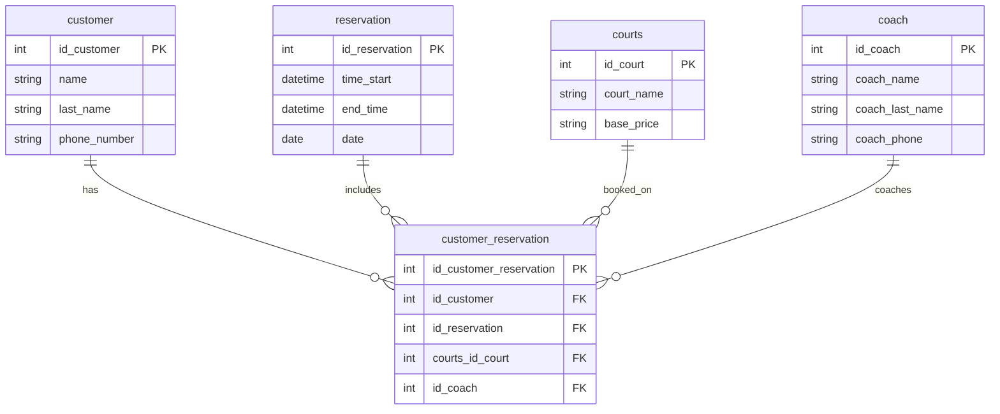

# Final project documentation

---

## Database summary report

### Project Overview

**Raquet Club** is a fiction company I created that operated in Fort Wayne as a club for sports that uses raquets such as Tennis, pickeball, Paddel, and racquetball. 

The person that will use this database are the analyst and financial people of the company to gather information to get budgeting and financial forecast of revenue and the service people that managest the schedules and organization of the courts.

### Users view
From a user's view the database will make every small detail of the company easy to reach and see. The staff can see the customers scheduled courts and times, they can also see if the customer is old or new to Raquet Club, they can see the proces of each courts sport and the availability of coaches, if they are book or not, or if any of them have time to be book in a walk-in class and if they are available.

The staff can also create different reports for the owner such as sum of profit for each quarter, month, year, the most common customer, how many reservations per day for each court, making these reports also live time data included making them more accurate and easy to generate new information if needed.


## Database ER Model


### Database Design Description


### Create Tables 
The following SQL statements create the `coach`, `customer`, `reservation`, `courts` and `customer_reservation` tables in the current database.

```sql

-- -----------------------------------------------------
-- COURTS Table
-- Stored the different types fo courts available and
-- the base price of each court
-- -----------------------------------------------------
CREATE TABLE IF NOT EXISTS `db_raquetclub`.`courts` (
  `id_court` INT NOT NULL AUTO_INCREMENT,
  `court_name` VARCHAR(45) NOT NULL,
  `base_price` VARCHAR(45) NOT NULL,
  PRIMARY KEY (`id_court`),
  UNIQUE INDEX `id_court_UNIQUE` (`id_court` ASC) VISIBLE)
ENGINE = InnoDB
AUTO_INCREMENT = 5
DEFAULT CHARACTER SET = utf8mb4
COLLATE = utf8mb4_0900_ai_ci;


-- -----------------------------------------------------
-- CUSTOMER TABLE
-- Store the personal information of the customers
-- -----------------------------------------------------
CREATE TABLE IF NOT EXISTS `db_raquetclub`.`customer` (
  `id_customer` INT NOT NULL AUTO_INCREMENT,
  `name` VARCHAR(45) NOT NULL,
  `last_name` VARCHAR(45) NULL DEFAULT NULL,
  `phone_number` VARCHAR(45) NOT NULL,
  PRIMARY KEY (`id_customer`),
  UNIQUE INDEX `id_customer_UNIQUE` (`id_customer` ASC) VISIBLE)
ENGINE = InnoDB
AUTO_INCREMENT = 31
DEFAULT CHARACTER SET = utf8mb4
COLLATE = utf8mb4_0900_ai_ci;


-- -----------------------------------------------------
-- RESERVATION TABLE
-- Store the information of date and time of each reservation
-- -----------------------------------------------------
CREATE TABLE IF NOT EXISTS `db_raquetclub`.`reservation` (
  `id_reservation` INT NOT NULL AUTO_INCREMENT,
  `time_start` DATETIME(6) NOT NULL,
  `end_time` DATETIME(6) NOT NULL,
  `date` DATE NOT NULL,
  PRIMARY KEY (`id_reservation`),
  UNIQUE INDEX `id_reservation_UNIQUE` (`id_reservation` ASC) VISIBLE)
ENGINE = InnoDB
DEFAULT CHARACTER SET = utf8mb4
COLLATE = utf8mb4_0900_ai_ci;


-- -----------------------------------------------------
-- COACH TABLE
-- Store the information of the different coaches from the company
-- -----------------------------------------------------
CREATE TABLE IF NOT EXISTS `db_raquetclub`.`coach` (
  `id_coach` INT NOT NULL AUTO_INCREMENT,
  `coach_name` VARCHAR(45) NOT NULL,
  `coach_last_name` VARCHAR(45) NOT NULL,
  `coach_phone` VARCHAR(45) NOT NULL,
  PRIMARY KEY (`id_coach`),
  UNIQUE INDEX `id_coach_UNIQUE` (`id_coach` ASC) VISIBLE,
  UNIQUE INDEX `coach_name_UNIQUE` (`coach_name` ASC) VISIBLE,
  UNIQUE INDEX `coach_last_name_UNIQUE` (`coach_last_name` ASC) VISIBLE,
  UNIQUE INDEX `coach_phone_UNIQUE` (`coach_phone` ASC) VISIBLE)
ENGINE = InnoDB;


-- -----------------------------------------------------
-- CUSTOMER RESERVATION TABLE
-- Store the custumer with it's specific reservation,
-- type of court and if using a coach or not
-- -----------------------------------------------------
CREATE TABLE IF NOT EXISTS `db_raquetclub`.`customer_reservation` (
  `id_customer_reservation` INT NOT NULL AUTO_INCREMENT,
  `id_customer` INT NOT NULL,
  `id_reservation` INT NOT NULL,
  `courts_id_court` INT NOT NULL,
  `id_coach` INT NULL,
  PRIMARY KEY (`id_customer_reservation`),
  INDEX `fk_customer_reservation_customer_idx` (`id_customer` ASC) INVISIBLE,
  INDEX `fk_customer_reservation_reservation1_idx` (`id_reservation` ASC) VISIBLE,
  INDEX `fk_customer_reservation_courts1_idx` (`courts_id_court` ASC) VISIBLE,
  INDEX `fk_customer_reservation_coach1_idx` (`id_coach` ASC) VISIBLE,
  UNIQUE INDEX `id_customer_reservation_UNIQUE` (`id_customer_reservation` ASC) VISIBLE,
  CONSTRAINT `fk_customer_reservation_courts1`
    FOREIGN KEY (`courts_id_court`)
    REFERENCES `db_raquetclub`.`courts` (`id_court`),
  CONSTRAINT `fk_customer_reservation_customer`
    FOREIGN KEY (`id_customer`)
    REFERENCES `db_raquetclub`.`customer` (`id_customer`),
  CONSTRAINT `fk_customer_reservation_reservation1`
    FOREIGN KEY (`id_reservation`)
    REFERENCES `db_raquetclub`.`reservation` (`id_reservation`),
  CONSTRAINT `fk_customer_reservation_coach1`
    FOREIGN KEY (`id_coach`)
    REFERENCES `db_raquetclub`.`coach` (`id_coach`)
    ON DELETE NO ACTION
    ON UPDATE NO ACTION)
ENGINE = InnoDB
DEFAULT CHARACTER SET = utf8mb4
COLLATE = utf8mb4_0900_ai_ci;
```

---

### Insert data
The following SQL insert sample data for the `court` (x4), `customer` (x60), and `reservation` (x165), `customer_reservation` (x179), `coach` (x8) tables in the current database.

```sql

-------------------------------------------------------
-- COURT SAMPLE DATA (20 rows)
-------------------------------------------------------

INSERT INTO `db_raquetclub`.`courts` (`id_court`, `court_name`, `base_price`) VALUES ('1', 'Tennis', '50');
INSERT INTO `db_raquetclub`.`courts` (`id_court`, `court_name`, `base_price`) VALUES ('2', 'Pickeball', '35');
INSERT INTO `db_raquetclub`.`courts` (`id_court`, `court_name`, `base_price`) VALUES ('3', 'Raquetball', '30');
INSERT INTO `db_raquetclub`.`courts` (`id_court`, `court_name`, `base_price`) VALUES ('4', 'Paddel', '50');


-------------------------------------------------------
-- CUSTOMER SAMPLE DATA (8 rows)
-------------------------------------------------------
INSERT INTO customer (id_customer, name, last_name, phone_number) VALUES
('John', 'Smith', '555-201-4432'),
('Emily', 'Johnson', '555-982-1144'),
('Michael', 'Brown', '555-771-9833'),
('Olivia', 'Davis', '555-663-1299'),
('Daniel', 'Miller', '555-448-2290'),
('Sophia', 'Wilson', '555-744-9934'),
('James', 'Anderson', '555-310-8841'),
('Emma', 'Thomas', '555-997-5402'),
('Benjamin', 'Taylor', '555-675-4122'),
( 'Ava', 'Moore', '555-223-9988'),
( 'Lucas', 'Jackson', '555-119-0345'),
( 'Mia', 'Martin', '555-882-3311'),
( 'Henry', 'Lee', '555-502-8804'),
( 'Charlotte', 'Perez', '555-664-7110'),
( 'Alexander', 'Thompson', '555-991-2043'),
( 'Amelia', 'White', '555-320-9114'),
( 'Ethan', 'Harris', '555-452-2333'),
( 'Harper', 'Sanchez', '555-888-1902'),
( 'Logan', 'Clark', '555-732-5227'),
( 'Luna', 'Ramirez', '555-408-6611'),
( 'Matthew', 'Lewis', '555-290-7483'),
( 'Ella', 'Walker', '555-640-9899'),
( 'Sebastian', 'Young', '555-770-5521'),
( 'Aria', 'Hall', '555-234-9981'),
( 'Jack', 'Allen', '555-811-4554'),
( 'Camila', 'King', '555-442-2294'),
( 'Owen', 'Wright', '555-554-7133'),
( 'Layla', 'Scott', '555-912-4200'),
( 'Leo', 'Torres', '555-345-9902'),
( 'Nora', 'Nguyen', '555-822-6491');
('Daniel', 'Reynolds', '260-555-4102'),
('Mariana', 'Lopez', '260-555-9984'),
('Carlos', 'Guzman', '260-555-7315'),
('Victoria', 'Sanders', '260-555-2841'),
('Felipe', 'Ortiz', '260-555-6630'),
('Angelica', 'Ruiz', '260-555-1774'),
('Samuel', 'James', '260-555-9031'),
('Natalia', 'Castro', '260-555-4420'),
('Brandon', 'Phillips', '260-555-8667'),
('Lucia', 'Torres', '260-555-1928'),
('Gabriel', 'Montoya', '260-555-5703'),
('Jasmine', 'Sullivan', '260-555-6179'),
('Ricardo', 'Valdez', '260-555-8840'),
('Camila', 'Rojas', '260-555-3049'),
('Andres', 'Mora', '260-555-1273'),
('Katherine', 'Brooks', '260-555-0231'),
('Sergio', 'Paredes', '260-555-9021'),
('Emily', 'Navarro', '260-555-5691'),
('Diego', 'Salazar', '260-555-6674'),
('Michelle', 'Harrison', '260-555-8417'),
('Ivan', 'Cortez', '260-555-7449'),
('Paula', 'Hernandez', '260-555-3157'),
('Anthony', 'Reeves', '260-555-0294'),
('Laura', 'Vega', '260-555-5551'),
('Oscar', 'Marquez', '260-555-2083'),
('Daniela', 'Ramirez', '260-555-9801'),
('Hector', 'Campos', '260-555-4127'),
('Jennifer', 'Payne', '260-555-2934'),
('Mauricio', 'Zamora', '260-555-7540'),
('Sofia', 'Delgado', '260-555-6198');


-------------------------------------------------------
-- RESERVATION SAMPLE DATA (8 rows)
-------------------------------------------------------
INSERT INTO reservations (time_start, end_time, date) VALUES
('2024-07-19 04:38:25.000000', '2024-07-19 07:03:16.000000', '2024-07-19'),
('2024-01-22 09:36:40.000000', '2024-01-22 11:49:17.000000', '2024-01-22'),
('2023-11-25 10:11:23.000000', '2023-11-25 11:44:37.000000', '2023-11-25'),
('2024-02-09 18:15:47.000000', '2024-02-09 19:23:53.000000', '2024-02-09'),
('2023-08-17 18:58:43.000000', '2023-08-17 21:07:54.000000', '2023-08-17'),
('2024-03-02 11:20:46.000000', '2024-03-02 13:54:19.000000', '2024-03-02'),
('2024-12-11 17:33:01.000000', '2024-12-11 20:14:33.000000', '2024-12-11'),
('2024-05-28 16:25:15.000000', '2024-05-28 18:28:25.000000', '2024-05-28'),
('2023-03-08 10:45:26.000000', '2023-03-08 12:40:46.000000', '2023-03-08'),
('2023-02-03 08:35:58.000000', '2023-02-03 10:12:14.000000', '2023-02-03'),
('2025-05-03 11:50:34.000000', '2025-05-03 13:10:01.000000', '2025-05-03'),
('2025-05-20 09:43:52.000000', '2025-05-20 11:53:32.000000', '2025-05-20'),
('2023-10-08 16:34:50.000000', '2023-10-08 19:30:20.000000', '2023-10-08'),
('2023-04-28 12:51:36.000000', '2023-04-28 14:16:11.000000', '2023-04-28'),
('2025-03-27 12:14:47.000000', '2025-03-27 13:43:14.000000', '2025-03-27'),
('2023-07-18 18:33:45.000000', '2023-07-18 19:40:34.000000', '2023-07-18'),
('2023-06-15 08:18:01.000000', '2023-06-15 09:15:51.000000', '2023-06-15'),
('2024-07-27 16:23:10.000000', '2024-07-27 18:15:37.000000', '2024-07-27'),
('2023-06-18 12:43:37.000000', '2023-06-18 14:45:16.000000', '2023-06-18'),
('2025-08-10 10:39:47.000000', '2025-08-10 12:38:06.000000', '2025-08-10'),
('2023-01-19 14:24:44.000000', '2023-01-19 17:06:38.000000', '2023-01-19'),
('2023-08-02 15:02:50.000000', '2023-08-02 17:04:24.000000', '2023-08-02'),
('2023-02-10 11:22:52.000000', '2023-02-10 12:33:35.000000', '2023-02-10'),
('2025-10-19 13:37:13.000000', '2025-10-19 15:57:13.000000', '2025-10-19'),
('2024-04-21 08:57:05.000000', '2024-04-21 11:25:36.000000', '2024-04-21'),
('2024-09-03 11:56:03.000000', '2024-09-03 13:49:11.000000', '2024-09-03'),
('2023-05-09 13:49:11.000000', '2023-05-09 16:30:20.000000', '2023-05-09'),
('2024-03-22 09:22:08.000000', '2024-03-22 11:32:06.000000', '2024-03-22'),
('2025-07-14 09:53:44.000000', '2025-07-14 12:00:37.000000', '2025-07-14'),
('2024-06-03 18:10:26.000000', '2024-06-03 20:30:14.000000', '2024-06-03'),
('2025-11-21 13:17:51.000000', '2025-11-21 15:25:59.000000', '2025-11-21'),
('2025-01-07 15:25:37.000000', '2025-01-07 16:35:14.000000', '2025-01-07'),
('2023-09-30 10:03:48.000000', '2023-09-30 11:09:19.000000', '2023-09-30'),
('2024-10-26 17:03:11.000000', '2024-10-26 19:00:54.000000', '2024-10-26'),
('2023-03-17 09:12:14.000000', '2023-03-17 11:50:23.000000', '2023-03-17'),
('2023-11-02 13:31:01.000000', '2023-11-02 14:53:50.000000', '2023-11-02'),
('2025-06-08 15:28:29.000000', '2025-06-08 16:51:32.000000', '2025-06-08'),
('2024-11-30 08:41:33.000000', '2024-11-30 11:25:19.000000', '2024-11-30'),
('2023-02-23 11:48:23.000000', '2023-02-23 13:40:55.000000', '2023-02-23'),
('2025-10-11 16:14:47.000000', '2025-10-11 18:59:35.000000', '2025-10-11'),
('2023-12-28 16:54:40.000000', '2023-12-28 19:16:45.000000', '2023-12-28'),
('2025-03-03 09:44:51.000000', '2025-03-03 12:18:04.000000', '2025-03-03'),
('2024-08-09 17:37:29.000000', '2024-08-09 19:40:40.000000', '2024-08-09'),
('2025-09-22 14:19:58.000000', '2025-09-22 17:01:59.000000', '2025-09-22'),
('2024-05-11 15:38:12.000000', '2024-05-11 17:10:36.000000', '2024-05-11'),
('2023-09-08 10:28:04.000000', '2023-09-08 11:47:45.000000', '2023-09-08'),
('2023-03-29 09:14:30.000000', '2023-03-29 11:18:58.000000', '2023-03-29'),
('2025-02-15 18:22:55.000000', '2025-02-15 20:03:33.000000', '2025-02-15'),
('2024-09-14 15:00:52.000000', '2024-09-14 16:40:37.000000', '2024-09-14'),
('2023-04-05 16:17:46.000000', '2023-04-05 18:59:40.000000', '2023-04-05'),
('2023-01-27 13:47:06.000000', '2023-01-27 15:00:06.000000', '2023-01-27'),
('2025-08-25 14:33:12.000000', '2025-08-25 16:21:35.000000', '2025-08-25'),
('2025-05-15 13:10:57.000000', '2025-05-15 15:20:23.000000', '2025-05-15'),
('2023-06-02 11:20:03.000000', '2023-06-02 13:51:57.000000', '2023-06-02'),
('2024-04-10 11:30:39.000000', '2024-04-10 13:18:24.000000', '2024-04-10'),
('2025-09-05 10:12:51.000000', '2025-09-05 12:44:43.000000', '2025-09-05'),
('2024-01-05 09:01:48.000000', '2024-01-05 10:24:39.000000', '2024-01-05'),
('2025-06-24 11:50:33.000000', '2025-06-24 14:00:51.000000', '2025-06-24'),
('2023-07-23 17:49:40.000000', '2023-07-23 20:19:42.000000', '2023-07-23'),
('2023-10-19 14:01:33.000000', '2023-10-19 15:08:17.000000', '2023-10-19'),
('2024-06-21 15:24:27.000000', '2024-06-21 17:45:21.000000', '2024-06-21'),
('2023-05-15 18:03:36.000000', '2023-05-15 19:13:28.000000', '2023-05-15'),
('2024-02-28 10:17:19.000000', '2024-02-28 12:13:49.000000', '2024-02-28'),
('2025-01-29 16:48:13.000000', '2025-01-29 19:29:41.000000', '2025-01-29'),
('2023-09-26 10:42:22.000000', '2023-09-26 12:34:20.000000', '2023-09-26'),
('2025-07-03 09:17:04.000000', '2025-07-03 11:09:55.000000', '2025-07-03'),
('2025-03-10 11:32:40.000000', '2025-03-10 13:10:55.000000', '2025-03-10'),
('2024-08-01 08:44:51.000000', '2024-08-01 11:19:12.000000', '2024-08-01'),
('2023-11-12 17:03:14.000000', '2023-11-12 18:27:48.000000', '2023-11-12'),
('2024-10-05 18:40:29.000000', '2024-10-05 20:06:52.000000', '2024-10-05'),
('2023-03-11 15:26:22.000000', '2023-03-11 17:13:41.000000', '2023-03-11'),
('2023-12-09 14:14:03.000000', '2023-12-09 16:02:54.000000', '2023-12-09'),
('2025-11-01 08:59:37.000000', '2025-11-01 10:38:27.000000', '2025-11-01'),
('2024-09-22 11:07:15.000000', '2024-09-22 12:36:30.000000', '2024-09-22'),
('2023-04-21 09:38:40.000000', '2023-04-21 11:49:50.000000', '2023-04-21'),
('2025-02-05 13:14:54.000000', '2025-02-05 14:57:05.000000', '2025-02-05'),
('2023-01-11 17:33:53.000000', '2023-01-11 19:26:40.000000', '2023-01-11'),
('2025-06-15 18:34:09.000000', '2025-06-15 20:04:53.000000', '2025-06-15'),
('2024-11-18 08:20:33.000000', '2024-11-18 10:57:05.000000', '2024-11-18'),
('2023-10-03 14:22:49.000000', '2023-10-03 16:32:52.000000', '2023-10-03'),
('2023-07-06 16:19:03.000000', '2023-07-06 17:58:01.000000', '2023-07-06'),
('2024-05-05 09:54:44.000000', '2024-05-05 12:16:39.000000', '2024-05-05'),
('2025-09-28 16:40:25.000000', '2025-09-28 18:29:39.000000', '2025-09-28'),
('2023-08-25 13:02:37.000000', '2023-08-25 15:26:24.000000', '2023-08-25'),
('2024-01-28 12:16:59.000000', '2024-01-28 13:29:54.000000', '2024-01-28'),
('2025-04-09 11:40:51.000000', '2025-04-09 13:43:12.000000', '2025-04-09'),
('2023-02-15 15:55:32.000000', '2023-02-15 18:16:11.000000', '2023-02-15'),
('2024-07-06 10:47:13.000000', '2024-07-06 12:40:41.000000', '2024-07-06'),
('2025-08-18 09:07:25.000000', '2025-08-18 11:32:09.000000', '2025-08-18'),
('2023-11-06 18:27:44.000000', '2023-11-06 20:35:45.000000', '2023-11-06'),
('2024-03-30 08:12:29.000000', '2024-03-30 09:32:32.000000', '2024-03-30'),
('2025-10-07 10:36:55.000000', '2025-10-07 12:26:02.000000', '2025-10-07'),
('2023-09-14 11:13:40.000000', '2023-09-14 13:28:22.000000', '2023-09-14'),
('2024-06-25 14:20:03.000000', '2024-06-25 16:25:43.000000', '2024-06-25'),
('2025-01-18 08:54:37.000000', '2025-01-18 11:09:25.000000', '2025-01-18'),
('2023-05-27 18:03:22.000000', '2023-05-27 19:33:05.000000', '2023-05-27'),
('2024-10-12 12:29:34.000000', '2024-10-12 14:45:22.000000', '2024-10-12'),
('2023-04-12 17:43:55.000000', '2023-04-12 19:04:46.000000', '2023-04-12'),
('2024-09-01 15:07:18.000000', '2024-09-01 17:41:44.000000', '2024-09-01'),
('2025-03-21 09:30:49.000000', '2025-03-21 11:40:38.000000', '2025-03-21'),
('2023-06-09 08:46:14.000000', '2023-06-09 10:00:08.000000', '2023-06-09'),
('2024-02-17 13:34:21.000000', '2024-02-17 16:12:02.000000', '2024-02-17'),
('2025-07-09 18:18:31.000000', '2025-07-09 20:54:10.000000', '2025-07-09'),
('2023-12-03 09:39:42.000000', '2023-12-03 11:32:25.000000', '2023-12-03'),
('2024-08-19 11:44:14.000000', '2024-08-19 13:52:58.000000', '2024-08-19'),
('2025-11-10 16:49:37.000000', '2025-11-10 19:01:27.000000', '2025-11-10'),
('2023-02-27 14:25:03.000000', '2023-02-27 16:57:10.000000', '2023-02-27'),
('2024-05-19 08:41:55.000000', '2024-05-19 10:09:08.000000', '2024-05-19'),
('2025-09-16 15:54:29.000000', '2025-09-16 18:14:20.000000', '2025-09-16'),
('2023-08-11 13:57:07.000000', '2023-08-11 15:41:01.000000', '2023-08-11'),
('2024-01-14 16:21:39.000000', '2024-01-14 18:33:21.000000', '2024-01-14'),
('2025-04-30 11:09:12.000000', '2025-04-30 13:43:38.000000', '2025-04-30'),
('2023-03-04 10:32:31.000000', '2023-03-04 12:26:13.000000', '2023-03-04'),
('2024-07-13 09:18:46.000000', '2024-07-13 11:53:17.000000', '2024-07-13'),
('2025-08-03 17:24:18.000000', '2025-08-03 19:49:55.000000', '2025-08-03'),
('2023-11-29 15:05:04.000000', '2023-11-29 17:19:38.000000', '2023-11-29'),
('2024-03-08 12:43:51.000000', '2024-03-08 14:10:06.000000', '2024-03-08'),
('2025-10-23 10:28:40.000000', '2025-10-23 12:24:26.000000', '2025-10-23'),
('2023-04-02 08:58:29.000000', '2023-04-02 10:26:16.000000', '2023-04-02'),
('2024-06-28 13:34:18.000000', '2024-06-28 16:02:20.000000', '2024-06-28'),
('2025-01-03 16:01:45.000000', '2025-01-03 18:20:54.000000', '2025-01-03'),
('2023-07-30 11:58:36.000000', '2023-07-30 13:27:30.000000', '2023-07-30'),
('2024-10-21 18:09:27.000000', '2024-10-21 20:43:19.000000', '2024-10-21'),
('2023-05-02 09:21:14.000000', '2023-05-02 11:57:31.000000', '2023-05-02'),
('2024-09-10 10:47:52.000000', '2024-09-10 12:02:33.000000', '2024-09-10'),
('2025-03-15 14:44:03.000000', '2025-03-15 17:18:37.000000', '2025-03-15'),
('2023-10-24 13:27:45.000000', '2023-10-24 15:01:57.000000', '2023-10-24'),
('2024-11-05 11:15:12.000000', '2024-11-05 13:43:33.000000', '2024-11-05'),
('2025-07-26 08:33:59.000000', '2025-07-26 10:09:43.000000', '2025-07-26'),
('2023-01-23 15:41:18.000000', '2023-01-23 17:54:27.000000', '2023-01-23'),
('2024-02-03 16:02:06.000000', '2024-02-03 17:15:35.000000', '2024-02-03'),
('2025-09-01 12:19:41.000000', '2025-09-01 14:32:55.000000', '2025-09-01'),
('2023-09-02 10:17:38.000000', '2023-09-02 12:28:19.000000', '2023-09-02'),
('2024-05-24 09:49:07.000000', '2024-05-24 11:10:52.000000', '2024-05-24'),
('2025-11-14 14:37:16.000000', '2025-11-14 17:05:48.000000', '2025-11-14'),
('2023-06-26 18:20:25.000000', '2023-06-26 19:54:35.000000', '2023-06-26'),
('2024-01-18 08:26:52.000000', '2024-01-18 10:51:00.000000', '2024-01-18'),
('2025-04-18 17:51:40.000000', '2025-04-18 20:13:29.000000', '2025-04-18'),
('2023-03-21 14:10:31.000000', '2023-03-21 15:23:47.000000', '2023-03-21'),
('2024-07-01 13:43:58.000000', '2024-07-01 16:01:45.000000', '2024-07-01'),
('2025-08-21 11:54:44.000000', '2025-08-21 13:17:39.000000', '2025-08-21'),
('2023-11-16 09:06:13.000000', '2023-11-16 11:44:01.000000', '2023-11-16'),
('2024-03-14 15:50:39.000000', '2024-03-14 17:21:28.000000', '2024-03-14'),
('2025-10-29 16:17:22.000000', '2025-10-29 18:49:01.000000', '2025-10-29'),
('2023-04-25 11:11:37.000000', '2023-04-25 13:31:16.000000', '2023-04-25'),
('2024-06-13 10:24:06.000000', '2024-06-13 12:03:27.000000', '2024-06-13'),
('2025-01-11 09:33:49.000000', '2025-01-11 12:09:41.000000', '2025-01-11'),
('2023-07-11 16:27:30.000000', '2023-07-11 18:45:53.000000', '2023-07-11'),
('2024-10-02 17:14:58.000000', '2024-10-02 19:01:05.000000', '2024-10-02'),
('2023-05-20 08:49:26.000000', '2023-05-20 10:05:30.000000', '2023-05-20'),
('2024-09-06 12:51:34.000000', '2024-09-06 14:37:23.000000', '2024-09-06'),
('2025-03-06 18:00:41.000000', '2025-03-06 20:08:15.000000', '2025-03-06'),
('2023-10-13 13:03:08.000000', '2023-10-13 14:47:32.000000', '2023-10-13'),
('2024-11-09 15:29:54.000000', '2024-11-09 17:58:24.000000', '2024-11-09'),
('2025-07-30 10:41:37.000000', '2025-07-30 13:05:52.000000', '2025-07-30'),
('2023-02-05 09:26:43.000000', '2023-02-05 11:11:06.000000', '2023-02-05'),
('2024-04-03 11:40:18.000000', '2024-04-03 13:48:10.000000', '2024-04-03'),
('2025-09-10 16:32:44.000000', '2025-09-10 18:12:54.000000', '2025-09-10'),
('2023-08-06 14:37:25.000000', '2023-08-06 17:05:49.000000', '2023-08-06'),
('2024-01-10 10:59:52.000000', '2024-01-10 12:41:50.000000', '2024-01-10'),
('2025-04-25 08:44:37.000000', '2025-04-25 10:58:13.000000', '2025-04-25'),
('2023-03-01 16:22:11.000000', '2023-03-01 18:12:45.000000', '2023-03-01'),
('2024-07-10 12:13:40.000000', '2024-07-10 14:33:29.000000', '2024-07-10'),
('2025-08-13 09:59:33.000000', '2025-08-13 12:39:20.000000', '2025-08-13'),
('2023-11-21 18:24:31.000000', '2023-11-21 20:18:53.000000', '2023-11-21');


-------------------------------------------------------
-- CUSTOMER_RESERVATION SAMPLE DATA (8 rows)
-------------------------------------------------------
INSERT INTO CUSTOMER_RESERVATION (id_customer, id_reservation, courts_id_court, id_coach) VALUES
(4, 1, 4, 7),
(10, 2, 2, 4),
(9, 3, 1, 4),
(27, 4, 3, 1),
(24, 5, 2, 8),
(28, 6, 4, 7),
(7, 7, 3, 2),
(1, 8, 3, 5),
(18, 9, 3, 6),
(7, 10, 3, 8),
(10, 11, 3, 7),
(18, 12, 3, 7),
(28, 13, 4, 4),
(23, 14, 2, 5),
(6, 15, 1, 1),
(5, 16, 3, 8),
(4, 17, 3, 8),
(17, 18, 3, 1),
(7, 19, 3, 7),
(27, 20, 2, 3),
(19, 21, 4, 6),
(13, 22, 2, 1),
(18, 23, 3, 5),
(5, 24, 2, 8),
(2, 25, 3, 8),
(2, 26, 3, 6),
(14, 27, 1, 1),
(21, 28, 1, 7),
(18, 29, 3, 7),
(21, 30, 4, 2),
(22, 31, 3, 2),
(16, 32, 3, 6),
(30, 33, 2, 3),
(17, 34, 1, 5),
(11, 35, 2, 2),
(22, 36, 4, 5),
(1, 37, 4, 6),
(23, 38, 1, 1),
(25, 39, 1, 3),
(1, 40, 2, 3),
(3, 41, 4, 7),
(18, 42, 1, 2),
(11, 43, 1, 7),
(28, 44, 3, 3),
(12, 45, 4, 7),
(18, 46, 1, 7),
(6, 47, 3, 5),
(23, 48, 3, 5),
(30, 49, 2, 8),
(28, 50, 2, 4),
(8, 51, 1, 8),
(26, 52, 1, 2),
(25, 53, 4, 7),
(22, 54, 1, 1),
(10, 55, 3, 5),
(21, 56, 1, 1),
(29, 57, 3, 1),
(4, 58, 4, 2),
(6, 59, 2, 8),
(2, 60, 3, 2),
(2, 61, 1, 5),
(5, 62, 3, 1),
(15, 63, 1, 2),
(24, 64, 4, 6),
(18, 65, 4, 7),
(6, 66, 3, 8),
(20, 67, 1, 8),
(10, 68, 3, 1),
(24, 69, 1, 4),
(24, 70, 2, 7),
(12, 71, 3, NULL),
(4, 72, 1, NULL),
(29, 73, 4, NULL),
(7, 74, 2, NULL),
(18, 75, 1, NULL),
(21, 76, 3, NULL),
(6, 77, 4, NULL),
(9, 78, 2, NULL),
(1, 79, 1, NULL),
(27, 80, 3, NULL),
(13, 81, 4, NULL),
(22, 82, 2, NULL),
(30, 83, 1, NULL),
(10, 84, 4, NULL),
(5, 85, 3, NULL),
(8, 86, 1, NULL),
(17, 87, 3, NULL),
(24, 88, 2, NULL),
(14, 89, 4, NULL),
(3, 90, 1, NULL);

-------------------------------------------------------
-- COACH SAMPLE DATA (8 rows)
-------------------------------------------------------
INSERT INTO coach (coach_name, coach_last_name, coach_phone)
VALUES
('Michael', 'Thompson', '260-555-1823'),
('Laura', 'Gonzalez', '260-555-7741'),
('David', 'Ramirez', '260-555-3398'),
('Sophia', 'Martinez', '260-555-8842'),
('Ethan', 'Walker', '260-555-6670'),
('Isabella', 'Hughes', '260-555-9012'),
('Jonathan', 'Kim', '260-555-4429'),
('Emily', 'Stevens', '260-555-7305');
```

---

### Queries

Queries using `coach`, `courts`, `customer`,  `customer_reservation`, `reservation` tables.

---

## Query 1 – `SELECT` with `ORDER BY` on two columns
```sql
-- Query 1: Select customers's reservation including court and if they have a coach or not ordered by id_customer and court type

SELECT id_customer, courts_id_court, id_reservation, id_coach 
FROM db_raquetclub.customer_reservation
ORDER BY id_customer, courts_id_court;

```

SELECT *, timestampdiff( hour ,time_start,end_time) AS "time" FROM db_raquetclub.reservation;

Because I was using dates, the time difference is the correcformula to get the difference of time and get the time the customer spent in the court.

SELECT id_customer, courts_id_court, id_reservation, id_coach FROM db_raquetclub.customer_reservation
order by id_customer, courts_id_court;

SELECT *, timestampdiff( hour ,time_start,end_time) AS "time" FROM db_raquetclub.reservation;

SELECT id_reservation, day(date) AS "Day", month(date) AS "Month", year(date) AS "Year" FROM db_raquetclub.reservation;

SELECT date, COUNT(1) AS "Quantity" FROM db_raquetclub.reservation
GROUP BY date;

SELECT date, COUNT(1) AS "Quantity" FROM db_raquetclub.reservation
GROUP BY date
HAVING day(date) = 3;

SELECT a.id_customer, a.id_reservation, a.courts_id_court, CONCAT(b.name, " ", b.last_name) AS "Customer", c.court_name, c.base_price, CONCAT(d.coach_name, " ", d.coach_last_name) AS "Coach" FROM db_raquetclub.customer_reservation AS a 
JOIN customer AS b ON a.id_customer = b.id_customer
JOIN courts AS c ON a.courts_id_court = c.id_court
JOIN coach AS d ON a.id_coach = d.id_coach;


LEFT JOIN shows the ID of the coaches that are empty while the right join and join do not shows these null in the id_coach, they behave the same.
